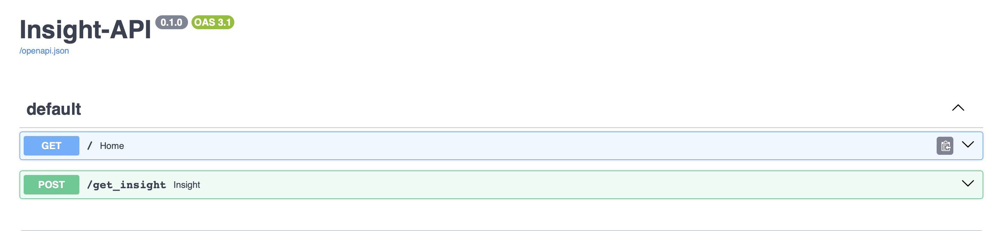
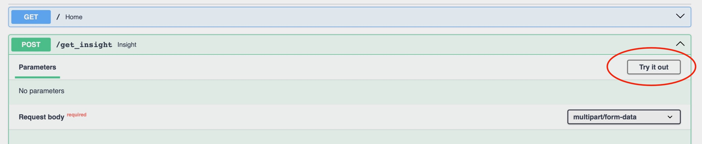
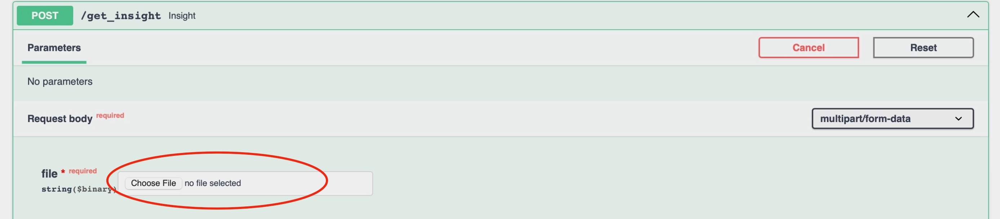
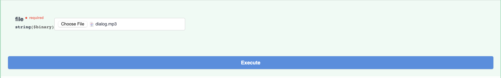

# Generating Insights from Conversation

This utilizes the [DeepGram Transcribe API](https://developers.deepgram.com/docs/getting-started-with-pre-recorded-audio) and Google Cloud Platform (App Engine and Cloud Storage) for deployment.

I used the [FastAPI](https://fastapi.tiangolo.com) to deploy as RESTful API service which can be interacted with using the Swagger UI.
The application takes an audio file containing the conversation of two people and returns relevant information on both the
individuals and what was being discussed.

Click [here](https://anotherfastapi.uc.r.appspot.com) to use the application


<p style="text-align: center;">API doc page</p>



<p style="text-align: center;">Click on try it out</p>



<p style="text-align: center;">Upload file</p>



<p style="text-align: center;">Execute</p>
To upload a file click on the drop down arrow "POST", then select "Try it out", click on "choose file" to upload an audio
file of a dialogue between two people from your local computer, finally execute!


When the user uploads the file, it is stored in a google cloud bucket which is subsequently accessed by DeepGram to get
audio via its remote file transcribe API. The result is then processed to match a dialogue format
such as:
```
speaker_0: Hi. Is this the Crystal Heights Hotel in Singapore? 
speaker_1: Yes, it is. Good afternoon. How may I assist you today? 
```

Using OpenAI API and prompt engineering, I am able to get a relevant insights from the GPT-4 model regarding the 
conversation. 

This is then displayed to the user. 

This API is scalable and flexible as it can be used on other platforms such as postman or the requests library in 
application developments. 


Some challenges faced were mostly in setting up the Google cloud platform, mostly in regards to the IAM, and putting the
right permissions on the Google cloud storage bucket. At the end, I found it quite intuitive, and very functional. 


